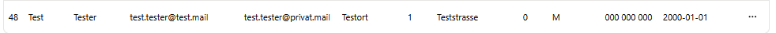
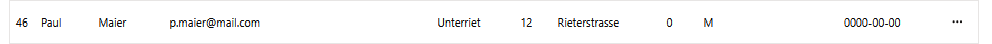
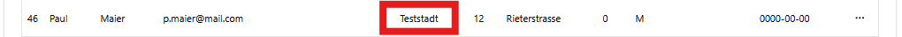
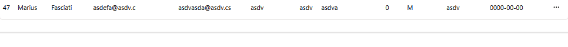

# Tests für das Ük. Modul 294

## Testkonzept
Exemplarisch wird die gesamte Route den Lernenden Endpoint durch getestet.

### Lernende

---
Die Route ist : https://localhost:3000/lernende

Auf dieser Page werden alle Lernende aufgelistet. Es werden alle Informationen aus den Columns aufgezeigt.

### 1. Neuer Lernender hinzufügen mit folgenden Daten :
```
vorname : Test
nachname : Tester
Email : test.tester@test.mail
Privat Mail : test.tester@privat.mail
Ort : Testort
Strasse : Teststrasse 1
Land : 0
Geschlecht : M
Telefon : 000 000 000
Geburtsdatum : 2000-01-01
```
Resultat : <br> 

<br>
Erwartete URL : http://localhost:3000/lernende/create
Resultat URL : http://localhost:3000/lernende/create

**Bestanden**

### 2. Den einen Lernenden Editieren mit diesen Konditionen :
```
Ort : Teststadt
```
Erwartete URL : http://localhost:3000/lernende/edit/<id>
<id> in dem Fall 46
Resultat URL : http://localhost:3000/lernende/edit/46

War : <br> 
 <br>
Resultat : <br> 


**Bestanden**

3. Den neuen Lernenden löschen :

Resultat : <br> 


**Bestanden**

Note : Aus Sicherheitsgründen wird bewusst kein URL Link für das löschen gemacht. 


